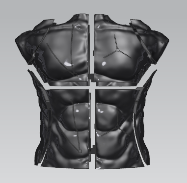
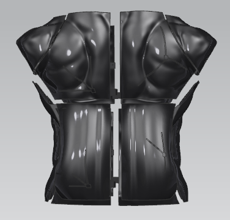
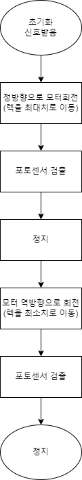
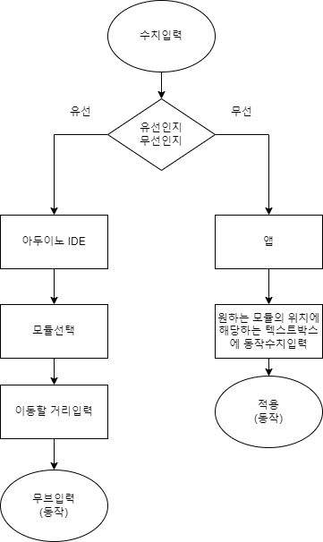

# 👔피팅머신👗

피팅머신는 하드웨어 기반의 Fashion open source project 입니다.

##  개요 

**`피팅머신`**은 인체 치수를 입력하면, 해당 크기로 모습이 변형되는  Open source Project 입니다.  

패션산업과 IT 기계의 융합화를 목표로 합니다.

* 3D 모델링 및 STL 출력파일
* 아두이노 Master - Slave 동작코드
* Serial Monitor 및 중앙 제어 시스템
* 랙과 피니언 기어, 스텝모터로 동작

##  주요 제품

    

<조각 정면>, <조각 후면>, <기둥>

##  구동부

  

<랙>, <피니언 기어>, <스텝모터와 드라이버>

##  제어 및 동작 흐름도

   

<초기화 프로세스>, <동작 프로세스>, <동작 흐름도> 

##  어플리케이션 인터페이스

​         

##  결과물

 

